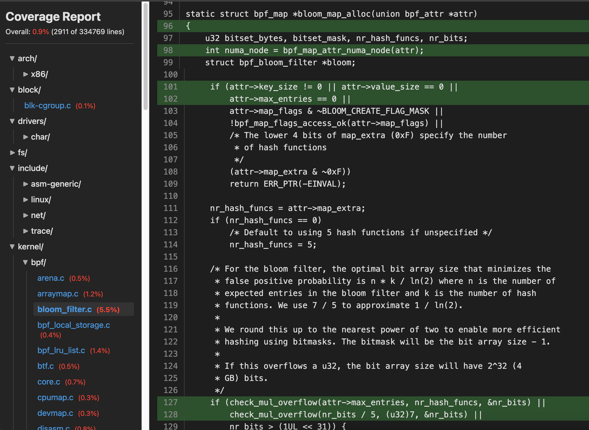

# cov2html

The function of the `cov2html` tool is to display the code coverage information obtained from the fuzzer in html form

Usage:

```sh
cargo run -- --input ./data/test_cov.txt --output ./test/ --source /home/xxx/linux-6.13.8
```

`data/` contains a sample of test_cov.txt and a coverage_report.html

**Result Screenshot**




